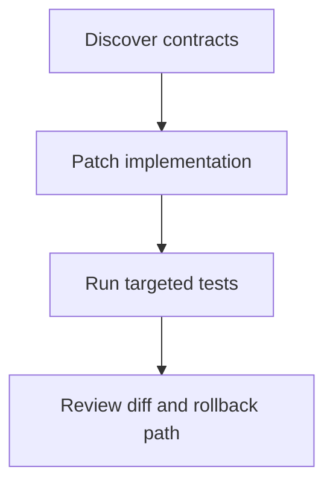
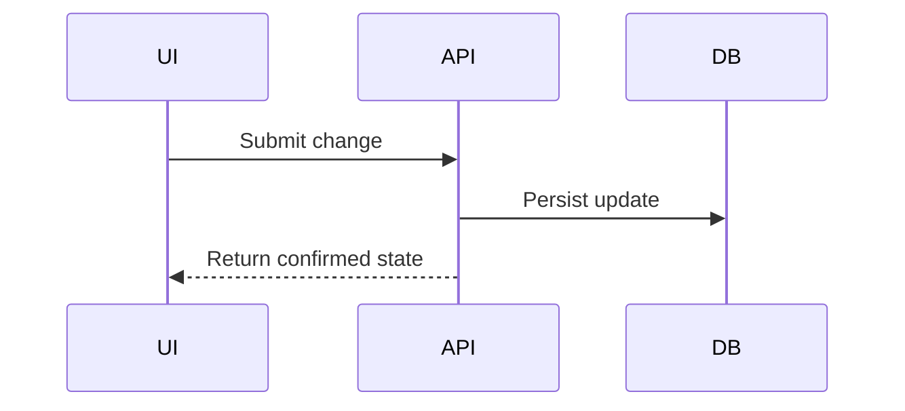

# Planning

## On Entering Plan Mode

Load this planning skill and every skill whose domain the planned work touches — the language, database, UI, or activity skill — before drafting, so the plan is grounded in their rules rather than corrected after approval. A UI redesign loads ui-ux-design before the plan is written, a schema change loads sql, and so on; read-only planning is not a reason to defer skill loading to the implementation phase. Present the plan only through the ExitPlanMode argument or an approved plan artifact. While planning, emit no interim narration — not "I'm in plan mode", not "the agent is still running", not a running map of progress; carry findings silently into the plan. A read-only agent dispatched during planning may inherit a plan-mode system-reminder that names tools it lacks; that is expected, and it disregards the reminder silently within its own tool set.

## Calibrate The Plan To The Stakes

Plans exist to reduce risk, not to demonstrate diligence. If the diff can be described in one sentence, the plan is that sentence plus its validation. A familiar low-risk change earns a short checklist. The full loop below is for multi-file, cross-contract, migration, security-sensitive, long-horizon, or delegation-heavy work. When enough information exists to act, act: do not re-derive established facts, re-litigate decided questions, or survey options that will not be pursued.

## Planning Loop

1. Confirm the operating boundary.
   - Stay read-only unless the user explicitly asks to create or edit a plan artifact.
   - Follow all active system, user, CLAUDE.md, ownership, approval, and validation rules. If instructions conflict, surface the conflict and follow the higher-priority or more specific rule.

2. Define the outcome.
   - State the goal in one sentence, the observable success criteria, and the invariants that must not break. Translate vague quality words ("robust", "fast", "clean") into observable properties before they enter the plan.
   - Identify scope, non-goals, write ownership, and affected surfaces.
   - For large or ambiguous features, interview the user first (AskUserQuestion): implementation constraints, UX, edge cases, and tradeoffs they have not considered yet. Record the answers as the spec the plan satisfies.
   - Otherwise ask only what blocks a safe plan; convert everything else into labeled assumptions.

3. Ground the plan in evidence.
   - Inspect the smallest useful set of files, docs, tests, logs, and errors. Delegate broad discovery to codebase-analysis or researcher agents so exploration does not flood the planning context.
   - Distinguish observed facts from assumptions and inferences. Prefer primary sources: repository code, project docs, official docs, test output, issue text, user-provided artifacts.
   - Do not invent repository details, tests, commands, package managers, or APIs. Missing evidence becomes an explicit discovery step at the top of the plan.
   - For non-trivial systems, map entry points, data flow, state transitions, trust boundaries, external services, persistence, deployment path, and affected contracts into a dependency graph; mark the critical path, parallel-safe work, serialization points, and merge gates so sequencing in step 5 rests on evidence, not guesswork.
   - When invoking a named planning, architecture, or delivery framework, tailor it to the repository evidence gathered here rather than copying the framework wholesale.

4. Choose the approach deliberately.
   - For non-trivial designs, weigh at least two candidate approaches, always including "change less" or "delete instead"; commit to one with a stated reason. Compare candidates on correctness, complexity, compatibility, security, performance, operability, migration cost, maintenance burden, and rollback, and record why the rejected alternatives lose.
   - Classify decisions as two-way doors (cheap to reverse: decide fast and move) or one-way doors (schema, public API, wire formats, data deletion, security model: slow down, plan rollback, confirm with the user).
   - Convert unknowns into timeboxed spikes with a question to answer and an exit criterion, instead of letting uncertainty leak into every step.

5. Shape the work.
   - Slice vertically: thin end-to-end slices that each produce observable behavior beat horizontal layers that integrate only at the end.
   - Start with a walking skeleton — the smallest path through every integration point — so integration risk dies first.
   - Put dependency-unblocking and assumption-testing steps first: environment setup, reproduction, schema discovery, API contract checks, risky decisions.
   - Keep steps small enough to review and validate independently; mark which run in parallel and which serialize. Give each step a stop condition, not only an acceptance check, so a bad result halts before it propagates.
   - Each milestone must produce an artifact, behavior, decision, or verification signal — decompose until it does.

6. Run a pre-mortem.
   - Assume the executed plan failed and name the most likely causes: wrong assumption, hidden coupling, broken contract, data surprise, missing permission, environment drift, flaky validation.
   - Give each cause a prevention step, a detection signal, and a recovery path; fold them into the sequence and the risks section.
   - Trace second-order effects: callers and contracts, data migration and rollback, performance at realistic scale, security surface, operational visibility, rate limits, timezones, encoding, accessibility, privacy, supply chain, and deployment ordering where relevant.

7. Specify validation and recovery.
   - Attach acceptance criteria to every phase; name the cheapest decisive check first and broaden only where risk justifies the cost.
   - Include rollback or recovery for migrations, destructive commands, data writes, dependency changes, config changes, deploys, and user-facing behavior.
   - Require explicit confirmation before irreversible or high-impact actions; if confirmation cannot be collected, the plan stops and asks before that step.

8. Review the plan backward before handing it off.
   - Starting from `Done When`, confirm every acceptance criterion has an implementing step and a verification step.
   - Remove steps that do not change a decision, artifact, behavior, or confidence level.
   - Confirm no step invents a file, command, API, dependency, or environment fact that was not observed or stated.

## Plan Output

Use this structure when it helps. Omit sections that would be empty or obvious for the task.

```md
## Goal
One sentence describing the desired end state.

## Scope
- In scope:
- Out of scope:
- Write ownership / constraints:

## Evidence
- Files or docs inspected:
- Relevant facts:
- Assumptions:
- Open questions:

## Decisions
- Chosen approach, the strongest alternative rejected, and the reason.
- One-way-door decisions that require confirmation.

## Affected Files And Interfaces
- Files, modules, APIs, data models, commands, services, or UI paths likely to change.

## Dependencies
- Tooling, services, credentials, package managers, migrations, feature flags, external docs, or user decisions.

## Risks
- Main risks and pre-mortem outcomes:
- Mitigations and detection signals:
- Rollback / recovery:

## Sequence
1. Step with expected output, acceptance criteria, and stop condition.
2. Step with expected output, acceptance criteria, and stop condition.
3. Validation step with exact command or manual check.

## Parallel Work
- Independent read-only research, tests, subagent tasks, or implementation tracks.
- Serialization points where results must merge before continuing.

## Validation Matrix
- Acceptance criterion or risk mapped to the command, test, inspection, or operational evidence that proves it, for work carrying enough distinct claims to need one.

## Done When
- Observable acceptance criteria and required validation results.
```

## Task Packet Pattern

For implementation handoffs to agents, produce a compact task packet per work unit instead of a narrative plan; the agent-delegation skill defines dispatch mechanics.

- Objective and user-visible acceptance criteria.
- Known facts: exact paths, symbols, commands, and decisions already made, so the agent rediscovers nothing.
- In scope, out of scope, allowed files, forbidden files, and ownership boundaries.
- Required validation commands with expected signals, and fallback if they cannot run.
- Rollback, recovery, or stop conditions for risky operations.

Do not delegate merely to make the plan look sophisticated. Keep shared-state writes serialized across packets and retain integration ownership in the main task.

## Long-Horizon Plans

For work expected to span sessions or context windows:

- Establish durable state early: a freeform progress file for notes and decisions, a structured status file for tests or tasks, git commits as checkpoints.
- Plan an initialization path — a setup script or documented commands — so a fresh session starts servers, tests, and linters without re-derivation.
- Write the bootstrap into the plan: which files a fresh context reads first and which fundamental check it re-runs before continuing new work.
- Size increments so each working window ends with a complete, committed component; significant uncommitted work at a checkpoint is a planning failure.
- Protect the test suite explicitly: weakening or deleting tests to make progress is never an allowed step.

## Quality Bar

- Golden rule: a competent engineer with no conversation context could execute the plan without asking a question; every step names its files, commands, and completion signal.
- The first step is executable immediately; no step depends on information the plan does not say how to obtain.
- Make references concrete: exact paths, symbols, scripts, commands, issue IDs, or URLs when known.
- Keep sequencing strict where order matters, especially around migrations, API contracts, dependency updates, generated files, and shared state.
- Prefer small milestones that can be reviewed and validated independently.
- The critical path and every one-way-door decision are visible, not buried inside a step's prose.
- Acceptance criteria cover observed behavior, not only file creation or command execution.
- Risks carry detection and recovery, not only a label.
- Estimates, when requested, state their assumptions and give a range instead of false precision.
- Do not over-plan routine one-file or obvious mechanical work; a short checklist may be enough.
- Do not hide uncertainty. Convert it into assumptions, questions, spikes, or validation steps.
- Do not let the plan contradict CLAUDE.md. If CLAUDE.md requires specific tests, style, ownership, commands, or forbidden paths, include those constraints directly in the plan.

## Change Control

Revise the plan when evidence invalidates an assumption, a dependency changes, validation fails, scope changes, or a risk crosses its stop threshold. Preserve the goal and decision history when revising; do not silently rewrite constraints the user already accepted.

## Evidence And Assumptions

Use evidence labels when the plan depends on facts that may be uncertain:

- `Observed:` directly inspected in the current run.
- `User-provided:` stated by the user or included in supplied artifacts.
- `Inferred:` likely from inspected evidence, but not directly confirmed.
- `Assumption:` accepted for planning because it is not blocking or must be confirmed later.
- `Needs confirmation:` blocking ambiguity that should be resolved before implementation.

If web research is needed, prefer official and primary sources. Use current sources for products, APIs, pricing, model behavior, regulations, dependencies, and external tools because these change. Cite the sources in the plan when the implementation depends on them.

## Sequencing And Parallelization

- Parallelize read-only exploration, source comparisons, independent test runs, and independent implementation tracks.
- Do not parallelize edits to the same files, migrations that share state, or steps where one result changes the next decision.
- Identify merge points: moments where results must be reviewed before continuing.
- For long-horizon work, define checkpoints with validation and a clear stop condition before proceeding.
- Give each subagent a narrow task, expected output, and file boundary; require summaries instead of raw noisy output. Task packets follow the agent-delegation skill: role, objective, exact files, constraints, forbidden actions, read/write scope, expected evidence, and merge point. Do not rely on implicit inheritance of context.

## Validation Strategy

Choose validation by risk:

- Documentation-only or plan-only change: syntax/spellcheck or source review may be enough.
- Narrow code change: targeted unit test, typecheck, lint, or focused reproduction.
- Cross-module behavior: integration tests, API contract checks, UI flow checks, and diff review.
- Data migration or destructive workflow: dry run, backup, rollback plan, staging verification, and explicit user approval.
- Security, privacy, payments, auth, or production operations: threat/risk review plus the strongest bounded validation available.

Always state validation that cannot be run, why it cannot be run, and what residual risk remains.

## Diagrams

Use Mermaid only when it clarifies architecture, data flow, state transitions, migration order, or parallel work. Keep diagrams small and factual. Do not add diagrams when a checklist is clearer.

Useful forms:





## Handoff

End with the smallest next action:

- If the plan is ready, say it is ready for implementation and name the first executable step.
- If clarification is required, ask only the blocking question(s).
- If the task is unsafe, too vague, outside ownership, or blocked by missing access, state the blocker and a safe alternative.
- If the user asks to implement after planning, follow the latest user instruction and the normal implementation workflow; do not keep using this skill unless the user returns to Plan mode or asks to revise the plan.
